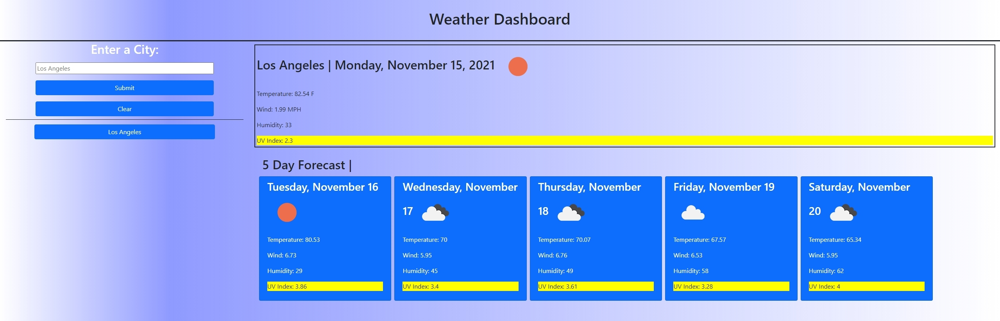

# <HW6-Weather-Dashboard>

## Description
Provide a short description explaining the what, why, and how of your project. Use the following questions as a guide:
- To learn how to utilize apis throughout different pages/applications.
- In order to create a website that utilizes data from an api while forcing user interaction.
- Solved how to correctly traverse through an API and utilize the exact information I need! :)
- Learned how to use fetch and then effectively and got a lot better with understanding functions! 

## Table of Contents (Optional)
If your README is long, add a table of contents to make it easy for users to find what they need.
- [Installation](#installation)
- [Usage](#usage)
- [Features](#features)
- [License](#license)

## Installation
What are the steps required to install your project? Provide a step-by-step description of how to get the development environment running.

## Usage

## Features
- Allows user to input city to then shift through openweatherAPI
- Calls the api information based on the city provided and populates the data for the current day and a 5 day forecast!
- Local storage elements allow the user to house previous inputs along with an intractable on click button to run the same function to pull up the data
- Full page reset in order to clear local storage and allow for fresh reset

## License
MIT License

Copyright (c) 2021 nodgyd

Permission is hereby granted, free of charge, to any person obtaining a copy
of this software and associated documentation files (the "Software"), to deal
in the Software without restriction, including without limitation the rights
to use, copy, modify, merge, publish, distribute, sublicense, and/or sell
copies of the Software, and to permit persons to whom the Software is
furnished to do so, subject to the following conditions:

The above copyright notice and this permission notice shall be included in all
copies or substantial portions of the Software.

THE SOFTWARE IS PROVIDED "AS IS", WITHOUT WARRANTY OF ANY KIND, EXPRESS OR
IMPLIED, INCLUDING BUT NOT LIMITED TO THE WARRANTIES OF MERCHANTABILITY,
FITNESS FOR A PARTICULAR PURPOSE AND NONINFRINGEMENT. IN NO EVENT SHALL THE
AUTHORS OR COPYRIGHT HOLDERS BE LIABLE FOR ANY CLAIM, DAMAGES OR OTHER
LIABILITY, WHETHER IN AN ACTION OF CONTRACT, TORT OR OTHERWISE, ARISING FROM,
OUT OF OR IN CONNECTION WITH THE SOFTWARE OR THE USE OR OTHER DEALINGS IN THE
SOFTWARE.
